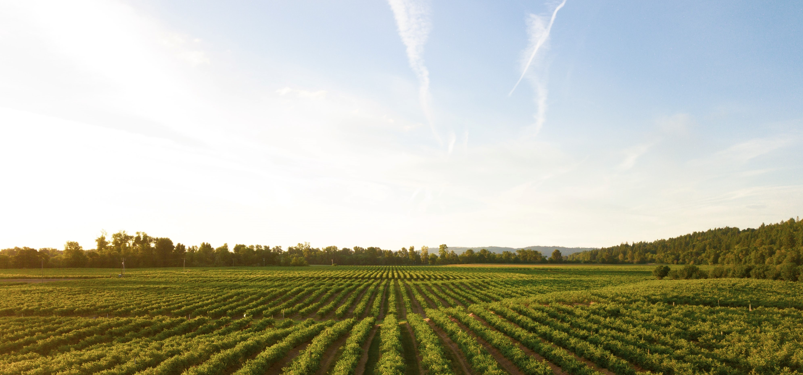

<p align='center'>
  <a href="https://www.python.org/">
            
  </a>&nbsp;&nbsp;
  <a href="https://flask.palletsprojects.com/en/2.0.x/">
            
  </a>&nbsp;&nbsp;
  <a href="https://www.tensorflow.org/">
    
  </a>&nbsp;&nbsp;
</p>
<br>
<p align='center'>
    
</p>

<br>

<a id="1"></a>

# Agraris Demo Link
#### [**Click here to view Agraris**](https://agraris.herokuapp.com/)

<br>

<a id="toc"></a>

# Table of Content
0. ##### [Table of Content](#toc)
1. ##### [Agraris Demo Link](#1)
2. ##### [About Agraris](#2)
	1. ###### [Background](#21)
	2. ###### [Goal & Aim](#22)
	3. ###### [How to Install & Deploy to Heroku](#23)
		1. [Installation of the Project to Personal Virtual Environment](#231)
		2. [Deploy Machine Learning Model with Flask on Heroku](#232)
	4. ###### [How Does the Inference Work? #1 - Crop Recommendation](#24)
	5. ###### [How Does the Inference Work? #2 - Plant Disease Classification](#25)
	6. ###### [Pllans & Realization](#26)
	7. ###### [Repository & Branch](#27)
	8. ###### [Bibliography](#28)
	9. ###### [Contributing developers](#29)

<br>


<a id="2"></a>

# About Agraris

**Agraris** is an Indonesian-languange based website x machine learning program which is currently under development process by 2 developers for the capstone project of ***Dicoding Studi Independen Bersertifikat*** of **MBKM 2021** from **Machine Learning x Front End** specialization path.

<br>

<a id="21"></a>

## Background

Indonesia's agricultural-purposed land has reached 7,46 millions of hectare (Kompas, 2021). Based on the data retrieved from Indonesia's Ministry of Communication and Information Technology, around 27,3% of Indonesia's citizen chose agriculture sector as their source of main income. This number continues to rise as Coronavirus-19 continues to emerge. The data from Indonesia's Ministry of Agriculture shows that 8 millions of new farmers are recorded in this pandemic era.

Sadly, the increasing number of farmers is not well-balanced by the literacy of land productivity planning. The main factor is the lack of access to best land productivity planning based on the land and crop compatibility. The compatibility of land and the crop has a great impact on the productivity of the land itself.

As the solution of the problem, a recommendation system which is able to be used easily is the demand. "Agraris" website is an ANN-based solution to help the land productivity planning of the land's condition by giving best crop recommendation for its users.

<br>

<a id="22"></a>

## Goal & Aim

- This website aims to help farmers (especially the ones implementing precision agriculture) as an utility for helping the farmers to decide what kind of crop to grow based on the land they are using. This feature hopefully is able to increase the land's productivity. 

- Agraris also has feature which can help farmers and hobbyists to identify their plants' disease by uploading the image of the plants' leaf. This feature should be able to help its users to detect, and identify the disease, and cop with it.

<br>

<a id="23"></a>

## How to Install & Deploy to Heroku

In this step, steps to install and deploy Agraris to Heroku will be explained with short brief of code. This process is divided into 2 parts, the first one is making the Flask project itself, and the second step is the hosting process in Heroku.

<br>

<a id="231"></a>

### Installation of the Project to Personal Virtual Environment

To be able to push it into a stand-alone virtual environment, follow this step. If you have already done this, step to the next step.

1. Clone this repository

```
git clone https://github.com/Yousei-kun/Agraris-Website-Sistem-Rekomendasi.git
```

2. Install Python Virtual Environment

```
virtualenv env
```

3. Install All the Requirements Inside "requirements.txt"

```
pip install -r requirements.txt
```

4. Import Flask App & Run Server

```
export FLASK_APP=app.py
flask run
```
---

<br>

<a id="232"></a>

### Deploy Machine Learning Model with Flask on Heroku

1. Create account in Heroku: https://id.heroku.com/login

2. Install Heroku CLI: https://devcenter.heroku.com/articles/heroku-cli#download-and-install

3. Login to Heroku from Windows PowerShell


```
# go to project folder
cd [copy-ur-path-here]\Agraris-Website-Sistem-Rekomendasi
# activate virtual environment
env\Scripts\activate
# login to heroku account
heroku login
```

5. Install Gunicorn

```
pip install gunicorn
```

6. Create Procfile (this is a file without extension, placed on the root of the folder)

Enter this code to Procfile file:

```
web:gunicorn app:app
```

7. Create Heroku app, add files to Git and deploy

```
# create a new heroku app
heroku create 'your-heroku-app-name'

# add files to git
heroku git:remote -a 'your-heroku-app-name'
git add .
git commit -m "Deploy to heroku"
git push heroku master
```

---

Credits & Full Tutorial:

- [Flower for You Documentation by Zanuarts](https://github.com/zanuarts/flower-for-you)

- [Deploy Machine Learning Model with Flask on Heroku](https://medium.com/@nutanbhogendrasharma/deploy-machine-learning-model-with-flask-on-heroku-cd079b692b1d)

<br>

<a id="24"></a>

## How Does the Inference Work? #1 - Crop Recommendation

1. Get the user input from **HTML form of the Flask page**. The "invisible" input parameters are temperature and humidity. Helping the user not to measure these parameters by themselves, an API of OpenWeather API is utilized in this project. This API is able to extract temperature and humidity of a region. So, these parameters are extracted as the substitute of temperature and humidity values.
2. Scale the user input, and cast it into the NumPy array using **normalization(user_input)**. This function's parameters are retrieved from the **df.describe()** function of the dataset. Scaling is applied to reduce the range between the minimum value of the data and the maximum value of the data. Then, the list of scaled values is converted into a NumPy array for the inference process.
3. Predict the user input using the model loaded from **load_model()**. The method used is **crop_recommendation_model.predict(np_user_input_scaled)**. This function returns an array of model's confidence of each label.
4. Cast the label of the prediction using **recommend_label(prediction)** to get the real readable result. From the array, the index of maximum value is fetched using **np.argmax(prediction)**. Then, this integer value is converted into a string of result based on the JSON label that matches the value. The result of this process is the string of the final result of the prediction, such as "padi", "jagung", etc.
5. The final result of prediction is returned to the view to be displayed for the user.

<br>

<a id="25"></a>

## How Does the Inference Work? #2 - Plant Disease Classification

1. Get the user **input of image from the Flask HTML page**. After checking for image's validity, the image uploaded is stored at **static/uploads** folder.
2. Extract the image's path.
3. Load the image using **tf.keras.utils.load_img**. This function is applied to **load an image from specified path** for the preparation of the classification. The image is **resized** into a **resolution of 150x150**.
4. The image is **converted** into an **array** of integers using **tf.keras.utils.img_to_array(img)**, as the model is not able to classify the image directly in the initial extension.
5. Expand the dimension of the array using **tf.expand_dims(img_array, 0)**.
6. Use the model to predict the array's class using **crop_disease_model.predict(img_array)**. This function returns an array of model's confidence of each label (**array of 38 values of classes available**). From the array, the index of maximum value is fetched using **np.argmax(prediction)**. 
7. Cast the label of the prediction using **disease_label(prediction)** to get the real readable result. Then, this integer value is **converted** into a **string of result** based on the **JSON label** that **matches the value**. The **result** of this process is the **string of the final result of the prediction**, such as "Busuk Daun", "Bercak Bakteri", etc.

<br>

<a id="26"></a>

## Plans & Realization

Development plan of this project can be seen in the Gantt Chart document provided in the link below:

https://bit.ly/CSD074-GanttChart

As the development has finished, these are the points conducted from the plan & realization:

- First week is the parallel work, as CSD-074 split the job to front-end development, and model development. The job has been done as planned (on time).

- Second week is time for additional feature, as there are plenty of time left on the pocket, so it is decided to make an additional feature of plant disease classification. So, the second week is spent on the new feature and its completion.

- Done on the third week are deployment and hosting process. Together, CSD-074 made pipeline for Agraris to be able to be made use by the users. The deployment used Flask as the main framework for Agraris, and the hosting process involved Heroku as the host.

- The other weeks are used for making project brief and documentation, and also the presentation of the project.


<br>

<a id="27"></a>

## Repository & Branch

This **Agraris Repository is divided** into **3 branches** (including master). Below is the explanation:

- **Website Development Branch** (fe-development)

  The website branch is the branch for front-end (dedicated for user) development. It is written in HTML, CSS, and JS to provide ease to migrate into the framework. You can check this branch for reference about Agraris' front-end development.

- **Machine Learning Development Branch** (ml-development)

  The ML branch is the branch for machine learning development. It is written in Python, and using most of basic library such as Pandas, NumPy, Sci-Kit Learn, and Tensorflow. Full documentation of the machine learning project with steps to make the model are clearly explained in the readme.md file of machine learning development branch, along with the testing pipeline of each model.

- **Main Branch** (master)

  Main branch is used as the integration branch of fe-development and ml-development. The plan is to use Flask framework to build and integrate the website and machine learning model as a whole website.

<br>

<a id="28"></a>

## Bibliography
<br>

<a id="281"></a>

### A. Dataset Links:

- **Crop Recommendation Dataset:**

  https://www.kaggle.com/atharvaingle/crop-recommendation-dataset

- **Plant Disease Classification Dataset:**

  https://www.kaggle.com/vipoooool/new-plant-diseases-dataset
  

<br>

<a id="282"></a>

### B. Library or external repository/API used:

- **Bootstrap**

  https://getbootstrap.com/

- **OpenWeather API**

  https://openweathermap.org/api

- **FancyBox**

  https://fancyapps.com/docs/ui/fancybox/

- **Animate on Scroll**

  https://michalsnik.github.io/aos/

- **Font Awesome**

  https://fontawesome.com/

- **Ionicons**

  https://ionic.io/ionicons
  

<br>

<a id="283"></a>

### C. Academic Paper Link:

- [1] Dwi, Aji Setyabudi dan Hindayati Mustafidah. (2016). Menentukan Jenis Tanaman Pertanian  Palawija Menggunakan Metode Simple Additive Weighting Dan Metode Weighted  Product. Accessed from https://bit.ly/CSD074-Ref-SistemRekomendasi on November 17th 2021 16.00.

- [2] Dwi, Budi Cahyono et al. (2018). Pengaruh Media Tanam dan Jenis Tanaman Terhadap Produksi Nutrien Bagian Aerial Tanaman Sorgum dan Jagung. Accessed from https://bit.ly/CSD074-Ref-Produktivitas2 on November 17th 2021 17.00

- [3] Fakultas Pertanian Universitas Terbuka UPBJJ-UT Banda Aceh. (2011). Faktor-Faktor yang Berhubungan dengan Kinerja Petani Jagung di Lahan Gambut. Accessed from https://bit.ly/CSD074-Ref-Produktivitas on November 17th 2021 15.00.

- [4] Putri, Safira Indira. (2021). Analisis SWOT Terhadap Studi Kelayakan Pengajuan Pembiayaan di Bank Syariah Indonesia KCP Pacitan. Accessed from https://bit.ly/CSD074-Ref-SWOT on November 17th 2021 17.30.

<br>

<a id="284"></a>

### D. References Link:

- [5] Bahfein, Suhaiela. (2020). “Luas Baku Tanah Sawah Nasional 7,46 Juta Hektar”.  Diakses melalui https://bit.ly/CSD074-Ref-Kompas on November 17th 2021 13.00.

- [6] CNN Indonesia. (2021). “Mentan: Ada 8 Juta Petani Baru di Indonesia karena Pandemi“.  Diakses melalui https://bit.ly/CSD074-Ref-CNNpada on November 17th 2021 14.00

<br>

<a id="29"></a>

## Contributing developers

**SIB Dicoding MBKM 2021 CSD-074**:

- M227R4190 - Ivan Budianto
- M193R4149 - Mochamad Nahrul Hayawan


